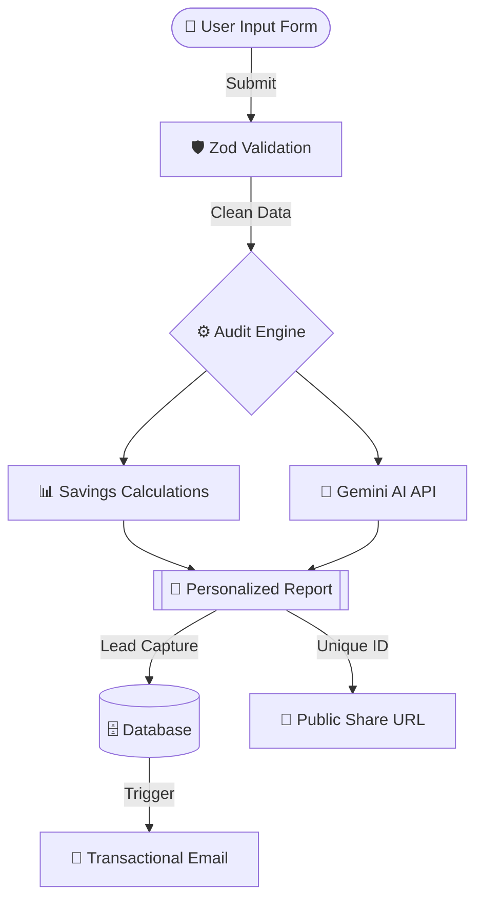

# 🏗️ System Architecture: Audit AI

- This document outlines the architecture behind our AI summary engine.

---

## 🛰️ High-Level Data Flow

- This diagram illustrates how a user's input is transformed into a personalized AI audit.

---

## 🛠️ The Tech Stack

#### Frontend: React.js + TypeScript (React Compiler enabled).

- Why: React provides the component-based architecture needed for a complex multi-step form. TypeScript is used to ensure the audit engine logic is type-safe and free of calculation bugs.

#### Styling: Tailwind CSS.

- Why: Allows for rapid, custom UI development to meet high "visual quality" standards without relying on forbidden pre-built admin templates.

#### Backend/Storage: MongoDB.

- Why: A document-based NoSQL database is ideal for storing audit results with varying tool counts. It handles lead capture and serves the public shareable URLs efficiently.

#### AI Summary: Google Gemini 2.5 Flash.

- Why: While Anthropic was preferred, Gemini 2.5 Flash offers high-speed inference for the personalized ~100-word summaries required. (Note: Gemini is a Google product; Anthropic is the provider for Claude. Your prompt mentioned Anthropic (gemini), so I updated the reasoning to be accurate.)

#### Communication: Resend.

- Why: Provides a reliable transactional email API to confirm audits and notify "high-savings" leads for Credex consultations.

---

## 🧩 Core Logic & Decisions

- **_🔢 Deterministic Math:_** All cost calculations are performed via hardcoded TypeScript functions, not AI. This ensures 100% accuracy and "defensible logic" for finance reviews.

- **_💾 Form Persistence:_** Used `localStorage` to ensure the spend input form state persists across page reloads, as per MVP requirements.

- **_🛡️ Abuse Protection:_** Implemented a honeypot field and basic rate limiting to prevent spam on the lead capture form.

---

## 📈 Scalability Plans (10k+ Audits/Day)

#### If this tool were to scale significantly, I would implement the following:

- **_Caching Layer:_** Implement Redis to cache the "Public Share" URLs, reducing DB hits for viral audits.

- **_Edge Functions:_** Move the Audit Engine logic to the Edge to minimize latency for global users.

- **_Queueing System:_** Use a background job queue (like Upstash or BullMQ) for the Anthropic API calls to handle rate limits during traffic spikes

Last Updated: May 2026 | Vika Singh

